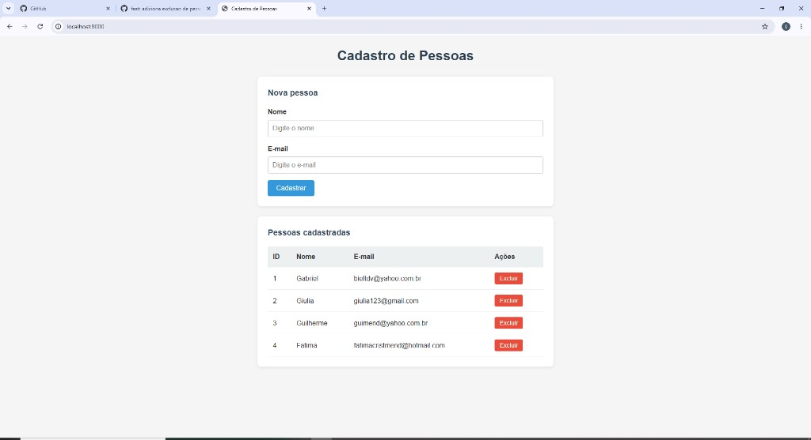

# Cadastro de Pessoas — API REST Full Stack

Aplicação web completa para cadastro e listagem de pessoas, desenvolvida com **Python**, **FastAPI**, **MySQL** e **Docker**. Projeto de portfólio demonstrando integração entre backend, banco de dados, frontend e containerização.


## Preview



---

## Sobre o projeto

Sistema CRUD com cadastro, listagem e exclusão (Create, Read, Delete) e arquitetura em camadas:

- **Frontend:** página HTML com JavaScript consumindo a API via `fetch`
- **Backend:** API REST com FastAPI e validação de dados (Pydantic)
- **Banco de dados:** MySQL com SQLAlchemy ORM
- **Infraestrutura:** Docker Compose com 2 containers (API + MySQL)

Ideal para demonstrar conhecimentos em desenvolvimento backend, persistência de dados e DevOps básico.

---

## Funcionalidades

- Cadastro de pessoas (nome + e-mail)
- Listagem de todas as pessoas cadastradas
- Exclusão de cadastros com confirmação
- Validação de e-mail e bloqueio de duplicatas
- Documentação interativa automática (Swagger)
- Ambiente containerizado — roda com um comando

---

## Tecnologias

| Camada | Tecnologia |
|---|---|
| Backend | Python 3.11, FastAPI, Uvicorn |
| Banco de dados | MySQL 8.0, SQLAlchemy, PyMySQL |
| Frontend | HTML, CSS, JavaScript |
| DevOps | Docker, Docker Compose |
| Versionamento | Git, GitHub |

---

## Arquitetura

```
Navegador (HTML + JS)
        │  HTTP (JSON)
        ▼
   API FastAPI (Python)
        │  SQL
        ▼
     MySQL 8.0
```

**Containers Docker:**

| Container | Função | Porta |
|---|---|---|
| `api_cadastro` | API FastAPI | 8000 |
| `mysql_cadastro` | Banco MySQL | 3306 |

---

## API Endpoints

| Método | Rota | Descrição |
|---|---|---|
| `GET` | `/` | Página web |
| `POST` | `/pessoas` | Cadastra uma pessoa |
| `GET` | `/pessoas` | Lista todas as pessoas |
| `DELETE` | `/pessoas/{id}` | Exclui uma pessoa pelo ID |
| `GET` | `/docs` | Documentação Swagger |

**Exemplo de requisição:**

```json
POST /pessoas
{
  "nome": "Maria Silva",
  "email": "maria@email.com"
}
```

---

## Como executar localmente

### Pré-requisitos

- [Docker Desktop](https://www.docker.com/products/docker-desktop/) instalado e em execução
- [Git](https://git-scm.com/downloads) instalado

> **Nota:** não é necessário instalar Python ou MySQL manualmente. O Docker cuida de tudo dentro dos containers.

### 1. Instalar o Docker Desktop

1. Acesse https://www.docker.com/products/docker-desktop/
2. Baixe e instale para o seu sistema operacional
3. Abra o Docker Desktop e aguarde o status **Engine running**
4. Verifique no terminal:

```bash
docker --version
docker compose version
```

### 2. Clonar o repositório

```bash
git clone https://github.com/mendgabriel/pocgithub.git
cd pocgithub
```

### 3. Build e execução

Na pasta do projeto, execute:

```bash
docker compose up --build
```

| Flag / comando | O que faz |
|---|---|
| `--build` | Reconstrói a imagem da API (necessário na 1ª vez ou após mudanças no código) |
| `up` | Sobe os containers da API e do MySQL |

Na primeira execução, pode demorar alguns minutos para baixar as imagens do Python e MySQL.

Quando estiver pronto, você verá no terminal:

```
Application startup complete.
Uvicorn running on http://0.0.0.0:8000
```

### 4. Acessar a aplicação

| Recurso | URL |
|---|---|
| Página web | http://localhost:8000 |
| Documentação Swagger | http://localhost:8000/docs |

### 5. Parar a aplicação

No terminal onde o Docker está rodando, pressione `Ctrl + C` ou execute em outro terminal:

```bash
docker compose down
```

### 6. Executar em segundo plano (opcional)

```bash
docker compose up --build -d
```

Para ver os logs:

```bash
docker compose logs -f api
```

### Solução de problemas

| Problema | Possível solução |
|---|---|
| Porta 8000 em uso | Pare outros serviços na porta 8000 ou altere a porta no `docker-compose.yml` |
| Docker não encontrado | Verifique se o Docker Desktop está aberto |
| Erro de conexão com MySQL | Aguarde o container `mysql_cadastro` ficar saudável e rode `docker compose up --build` novamente |
| Erro WSL no Windows | Instale o WSL 2 com `wsl --install` e reinicie o computador |

---

## Estrutura do projeto

```
pocgithub/
├── app/
│   ├── main.py          # Rotas da API
│   ├── database.py      # Conexão com MySQL
│   ├── models.py        # Modelo da tabela pessoas
│   └── schemas.py       # Validação Pydantic
├── static/
│   └── index.html       # Interface web
├── Dockerfile
├── docker-compose.yml
├── requirements.txt
└── README.md
```

---

## Git Flow

Este projeto utiliza **Git Flow** para organizar o desenvolvimento, simulando o fluxo de trabalho de equipes de TI.

| Branch | Função |
|---|---|
| `main` | Código em produção (estável) |
| `develop` | Integração de novas funcionalidades |
| `feature/*` | Desenvolvimento de features isoladas |
| `hotfix/*` | Correções urgentes em produção |

Documentação completa: [GITFLOW.md](GITFLOW.md)

---

## Competências demonstradas

- Desenvolvimento de API REST
- Git Flow e Pull Requests
- Integração com banco de dados relacional (ORM)
- Validação e tratamento de erros
- Containerização com Docker
- Versionamento com Git/GitHub
- Documentação de projeto

---

## Autor

**Gabriel Mendonça** — [GitHub](https://github.com/mendgabriel)

---

## Licença

Este projeto é de código aberto e está disponível para fins de estudo e portfólio.
